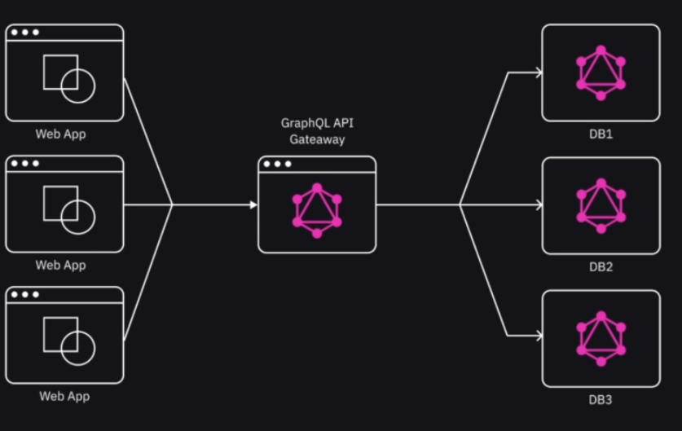

# GraphQL intro

GraphQL is a query language for APIs and a runtime env. for executing those queries. 


## How it works

Hosted in a separate server, and the API gateway allows you to query that data:




We can see the request and response below

request:

```graphql
query{
    posts{
    title, 
    content,
    author
    }
}
```


resposne:

```graphql
{
    "data":{
        "books":[{
            "id":"3",
            "title": "GraphQL book",
            "content": "books for dev"
            "author":"push-ya"     
        }]
    }
}
```


Pros:

- instead of sending multiple queries to fetch various types of data, GraphSQL allows clients to request only the data they need in single query.


We are going to going to have the following setup:

> web app <- GraphQL gateway <- nodejs


We will use    `MongoDB atlas` database and using GraphQL API to query from the database


## Side note

This also helped me learn how to deploy and use Cloud database services. 

- How to setup automated opeartiosn such as routine provisioning, patching backups and monitoring

- work with RBAC (roole based access control)

- Monitoring and creating alerts for the database


